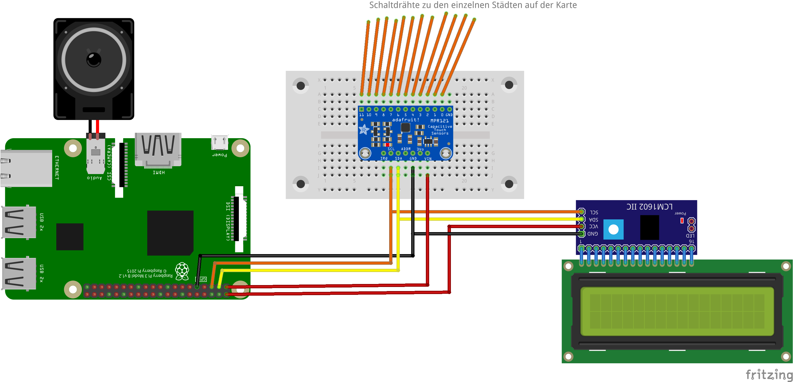

# Travel the world - Weiterentwicklung des Scoutlab Projektes aus 2017
[Travel the world - Scoutlab Projekt 2017](https://vcp-scoutlab.github.io/scoutlab-2017/travel_the_world/)

## Kurzbeschreibung:
Interaktive Weltkarte: Durch Anfassen einer Stadt auf der Karten wird der Ortsnamen und Ortszeit auf einem Display angezeigt. Daneben wir die passende Nationalhymne als Musik über einen PC-Lautsprecher ausgegeben. Der Lautsprecher wird am Audio-Anschluss des Raspberry Pi eingesteckt.

## Zielgruppe
Für die Umsetzung: Pfadfinder\*innen // Ranger\*Rover
"Lernen der Welt" ist auch schon für einen jüngere Zielgruppe geeignet.

## Materialbedarf
+ Sperrholzplatte A3
+ Ausdruck Weltkarte in A3 [Vorlagen](https://github.com/pediehl/travel_the_world_electric_paint/tree/master/appendix)
+ Raspberry Pi
+ 1 Steckbrett
+ [Adafruit MPR121](https://learn.adafruit.com/mpr121-capacitive-touch-sensor-on-raspberry-pi-and-beaglebone-black) (Kapazitiver Sensor der 12 Kontakten verarbeiten kann) - Anleitung vom Hersteller: [Adafruit](https://learn.adafruit.com/mpr121-capacitive-touch-sensor-on-raspberry-pi-and-beaglebone-black)
+ LCD-Display mit I2C-Modul
+ Kabel
+ leitende Farbe ([Tube von BareConductive](https://www.bareconductive.com/))
+ Rolle Schaltdraht (Querschnitt 0.2 mm&sup2;)

## ChangeLog seit Scoutlab 2017
01.11.2017: Eingabe der Zeitzone im Verhältnis zur aktuellen Uhrzeit für jede Stadt umgesetzt
01.11.2017: Berechnung und Ausgabe der Uhrzeit umgesetzt
20.03.2018: optimieren des Quell-Code
20.03.2018: Umstellung auch LCD-Display auf I2C. Erweiterung um die passenden zwei Display Dateien (Treiber)
20.03.2018: H:%M   %d.%m.%y, Ausgabe des Datums neben der Ortszeit, um auch den Datumswechsel bei der Ortszeit/Zeitzone deutlich zu machen.
29.03.2018: Beheben des Schreibfehlers im Quelltext brasilien.wav konnte nicht gefunden werden.
29.03.2018: Landeshymne stoppt automatisch, sobald eine andere Stadt ausgewählt wird. Jetzt schnelles Umschalten möglich.

## Aufbau

